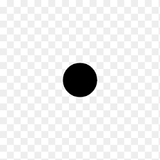

<h2 align="left">Hi 👋 I'm Ramanshu Sharan Mishra</h2>

###

  
  

###

  <h3>Some facts about me:</h3>

  

    
    I Code
  

  

    
    I have no Life
  

  

    
    I keep learning
  

  

    
    All it takes is a smile to be my friend
  

###

  

  

  

  

###

 

###
